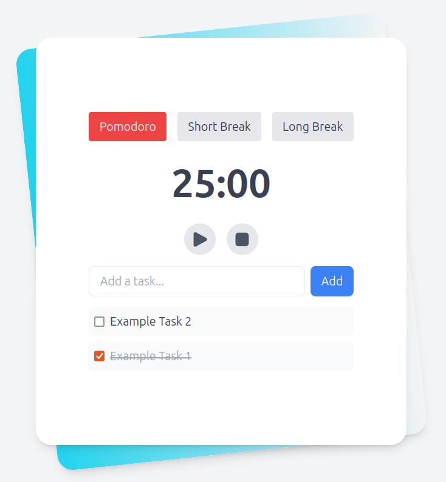

# Pomodoro

## Frontend

<p align="center"></p>

## Backend API examples

### Create a new session

```bash
$ curl -X POST http://localhost:3001/api/sessions \
  -H "Content-Type: application/json" \
  -d '{"duration": 1500, "type": "pomodoro"}'
{
  "id": 1
}
```

### List all sessions

```bash
$ curl -X GET http://localhost:3001/api/sessions | jq
[
  {
    "id": 2,
    "start_time": "2025-01-03 04:59:17",
    "duration": 1500,
    "type": "pomodoro",
    "task_count": 3,
    "completed_tasks": 1
  },
  {
    "id": 1,
    "start_time": "2025-01-03 01:11:38",
    "duration": 1500,
    "type": "pomodoro",
    "task_count": 7,
    "completed_tasks": 6
  }
]
```

### Delete a session (replace {id} with actual session ID)

```bash
$ curl -X DELETE http://localhost:3001/api/sessions/{id} | jq
{
  "message": "Session and associated tasks deleted successfully",
  "changes": 1
}
```

### Create a new task

```bash
$ curl -X POST http://localhost:3001/api/tasks \
  -H "Content-Type: application/json" \
  -d '{"sessionId": 1, "description": "Complete project documentation"}'
{
  "id": 1
}
```

### List all tasks

```bash
$ curl -X GET http://localhost:3001/api/tasks | jq
[
  {
    "id": 2,
    "session_id": null,
    "description": "Example task description",
    "completed": 0
  },
  {
    "id": 1,
    "session_id": null,
    "description": "Example task description",
    "completed": 1
  }
]
```

### Update task completion status

```bash
$ curl -X PUT http://localhost:3001/api/tasks/{id} \
  -H "Content-Type: application/json" \
  -d '{"completed": true}'
{
  "changes": 1
}
```

### Delete a task (replace {id} with actual task ID)

```bash
$ curl -X DELETE http://localhost:3001/api/tasks/{id} | jq
{
  "message": "Task deleted successfully",
  "changes": 1
}
```

